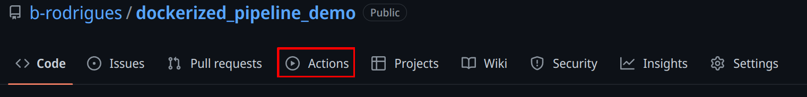

# Continuous Integration with GitHub Actions

## Introduction

We are almost at the end of our journey. In the previous chapters, we built
reproducible environments with Nix, organised our code into pure functions,
made them robust with error handling and debugging, proved correctness with
unit tests, managed our collaboration with Git, and bundled everything into
shareable packages. We can now run our pipelines in a 100% reproducible way.

However, all of this still requires manual steps. And maybe that's not a
problem; if your environment is set up and users only need to drop into a Nix
shell and run the pipeline, that's already a huge improvement. But you should
keep in mind that manual steps don't scale. Imagine you are part of a team that
needs to quickly ship products to clients. Several people contribute to the
product, and you might need to work on multiple projects in the same day. You
and your teammates should be focusing on writing code, not on repetitive tasks
like building images or running tests. Ideally, we would want to automate these
steps. That is what we are going to learn in this chapter.

This chapter will introduce you to **Continuous Integration (CI)** with GitHub
Actions. You will learn how to set up workflows that automatically run your
tests when you push code, how to build Docker images and recover artifacts, and
how to run your pipelines directly from GitHub's servers. Because we're using
Git to trigger all the events and automate the whole pipeline, this approach is
sometimes called GitOps.

You may have heard the term "CI/CD," where CD stands for Continuous Deployment
or Continuous Delivery. We will focus on CI in this chapter. Continuous
Deployment (automatically pushing results to a database, dashboard, or API) is
highly specific to your organisation and infrastructure. What we cover here,
however, gives you the foundation: once your pipeline runs reliably on CI, the
"deployment" step is just one more workflow job pointing to wherever your
results need to go.

## Getting your repo ready for Github Actions

Obviously, you should use a project that is versioned on GitHub. Use the package
we’ve developed previously. If you go on its GitHub page, you should see an
"Actions" tab on top:

<div style="text-align:center;">
```{r, echo = F}

```
</div>

This will open a new view where you can select a lot of available, ready to use
actions. "Actions" are premade scripts that execute some commands you might
need: such as setting up R, Python, running tests, etc. Since we’re using Nix,
we don’t really need to look for any actions to set up our environments.
However, we might want to use some pre-made actions to upload artifacts for
instance.

To actually configure our repository to run actions, we need to edit a file in
our project under the `.github/workflows` directory (create them if needed). In
it, write a `yaml` file called `hello.yaml` and write the following in it:

```yaml
name: Hello world
on: [push]
jobs:
  say-hello:
    runs-on: ubuntu-latest
    steps:
      - run: echo "Hello from Github Actions!"
      - run: echo "This command is running from an Ubuntu VM each time you push."
```

Let's study this workflow definition line by line:

```
name: Hello world
```

Simply gives a name to the workflow.

```
on: [push]
```

When should this workflow be triggered? Here, whenever something gets pushed.

```
jobs:
```

What is the actual things that should happen? This defines a list of actions.

```
  say-hello:
```

This defines the `say-hello` job.

```
    runs-on: ubuntu-latest
```

This job should run on an Ubuntu VM. You can also run jobs on Windows or macOS
VMs, but this uses more compute minutes than a Linux VM (which doesn’t matter
for public projects. For private projects, the amount of compute minutes
is limited).

```
    steps:
```

What are the different steps of the job?

```
      - run: echo "Hello from Github Actions!"
```

First, run the command `echo "Hello from Github Actions!"`. This commands runs
inside the VM. Then, run this next command:

```
      - run: echo "This command is running from an Ubuntu VM each time you push."
```

If we take a look at the commit we just pushed, on GitHub, we see this yellow
dot next to the commit name. This means that an action is running. We can then
take a look at the output of the job, and see that our commands, defined with
the `run` statements in the workflow file, succeeded and echoed what we asked
them.

## Nix and GitHub Actions

To set up Nix on GitHub Actions you can use several steps (create a new file
called `run-tests.yaml`):

```yaml
- name: Install Nix
  uses: cachix/install-nix-action@v31
  with:
    nix_path: nixpkgs=https://github.com/rstats-on-nix/nixpkgs/archive/r-daily.tar.gz

- name: Setup Cachix
  uses: cachix/cachix-action@v15
  with:
    name: rstats-on-nix
```

If your repository contains a `flake.nix` and `flake.lock` (as a T project
does), the same environment you’ve been using locally can be used on GitHub
Actions just as easily. The committed flake pins the exact T version and every
dependency, so there is nothing to generate — `nix develop` reads it directly:

```yaml
- name: Run in the project environment
  run: nix develop --command t --version
```

You can then use the shell to run whatever you need. For example, if you’re
developing a package, you could run unit tests on each push:

```yaml
- name: devtools::test() via nix develop
  run: nix develop --command Rscript -e "devtools::test(stop_on_failure = TRUE)"
```

`stop_on_failure = TRUE` is needed to make the step fail if there’s an error,
otherwise, the step would run successfully, even with failing tests.

Of course, if you’re developing a Python package, use `nix develop --command pytest`
instead to run the tests.

I highly recommend you run tests when pull requests get opened:

```yaml
on:
  push:
    branches: [ "main" ]
  pull_request:
    branches: [ "main" ]
```

This will ensure that if someone contributes to your project, you know
immediately if what they did breaks tests or not. If it does, ask them to fix
the code until tests pass.

## Running a T Pipeline on GitHub Actions

Now that we know how to set up Nix on GitHub Actions, running a T pipeline is
straightforward. Recall from Chapter 4 that T is distributed exclusively via
Nix: you never install it in the traditional sense. A T project pins the exact
version of T it uses in its committed `flake.nix` and `flake.lock` files, and
`nix develop` drops you into a shell where that pinned `t` executable is
available alongside all of your R, Python, and Julia runtimes.

That means "installing T" on CI is really just "installing Nix." Once Nix is
present, the project's own flake takes care of the rest. Here is a complete
workflow that runs our pipeline on every push and pull request to `main`:

```yaml
name: T Pipeline

on:
  push:
    branches: [ "main" ]
  pull_request:
    branches: [ "main" ]

jobs:
  build:
    runs-on: ubuntu-latest
    steps:
      - uses: actions/checkout@v4

      - name: Install Nix
        uses: cachix/install-nix-action@v31
        with:
          extra_nix_config: |
            experimental-features = nix-command flakes
            substituters = https://cache.nixos.org https://rstats-on-nix.cachix.org
            trusted-public-keys = cache.nixos.org-1:6NCHdD59X431o0gWypbMrAURkbJ16ZPMQFGspcDShjY= rstats-on-nix.cachix.org-1:vdiiVgocg6WeJrODIqdprZRUrhi1JzhBnXv7aWI6+F0=

      - name: Setup Cachix
        uses: cachix/cachix-action@v15
        with:
          name: rstats-on-nix

      - name: Run pipeline
        run: nix develop --command t run --failfast src/pipeline.t
```

The `extra_nix_config` block enables Nix flakes and points Nix at the
`rstats-on-nix` binary cache, so R packages are downloaded pre-built rather
than compiled from source. The `Setup Cachix` step registers that cache so the
runner can pull from it.

The important line is the last one:

```
run: nix develop --command t run --failfast src/pipeline.t
```

`nix develop` enters the project's environment using the committed
`flake.lock`, which is where the T version is pinned. We then run `t run` on
`src/pipeline.t`, exactly as we would locally. The `--failfast` flag makes the
step, and therefore the whole workflow, fail as soon as any node errors, which
is what you want on CI: a red build should mean something is actually broken.

A couple of notes:

- If you have changed `tproject.toml` (added a package, bumped a version), run
  `t update` first to regenerate `flake.nix` and `flake.lock`, then commit those
  files, the same one-time sync you do locally.
- Chapter 8 showed the `pipeline_to_ga()` function, which generates a workflow
  like this one automatically, including artifact caching. Writing it by hand,
  as here, just makes each moving part explicit.

### Caching T pipeline outputs between runs

Nix already caches builds in its store, but a fresh CI runner starts with an
empty store, so every node is rebuilt from scratch on the first run. T has
native functions for shipping a pipeline's cached artifacts between runs, so a
second run can skip the work a first run already did.

`export_artifacts(p, archive_path)` bundles the cached Nix artifacts of every
node in `p` into a single portable archive file. All nodes must already exist
in the local store, so you call it right after a successful build:

```t
#| eval: false
build_pipeline(p)
export_artifacts(p, "artifacts.tar")
```

On the next run, `import_artifacts()` restores those artifacts into the local
Nix store before you build, so unchanged nodes are pulled from the archive
instead of rebuilt:

```t
#| eval: false
import_artifacts("artifacts.tar")
build_pipeline(p)
```

The two-argument form, `import_artifacts(p, "artifacts.tar")`, additionally
verifies that the imported store paths match the pipeline's expected
signatures, catching a stale or mismatched archive.

To see what an archive contains without touching the local store, use
`inspect_artifacts()`. It loads the archive into a temporary store and returns
a data frame with one row per node:

```t
#| eval: false
inspect_artifacts("artifacts.tar")
-- columns: node, store_path, hash, size_bytes, references
```

On GitHub Actions the pattern is to export the archive after a successful
build and upload it as a workflow artifact, then download and import it at the
start of the next run. Combined with the `rstats-on-nix` binary cache above,
this keeps even a cold runner from recompiling anything that has not changed.

## Running a dockerized workflow

This next example can be found in [this
repository](https://github.com/b-rodrigues/dockerized_pipeline_demo)^[https://github.com/b-rodrigues/dockerized_pipeline_demo]. This
example doesn't use Nix or T, but the point here is to show
how a Docker container can be executed on GitHub Actions, and artifacts can be
recovered. The process is always the same, regardless is inside the Docker
image. If you want to follow along, fork this repository.

This is what our workflow file looks like:

```yaml
name: Reproducible pipeline

on:
  push:
    branches: [ "main" ]
  pull_request:
    branches: [ "main" ]

jobs:

  build:

    runs-on: ubuntu-latest

    steps:
    - uses: actions/checkout@v5
    - name: Build the Docker image
      run: docker build -t my-image-name .
    - name: Docker Run Action
      run: docker run --rm --name my_pipeline_container -v /github/workspace/fig/:/home/graphs/:rw my-image-name
    - uses: actions/upload-artifact@v4
      with:
        name: my-figures
        path: /github/workspace/fig/

```

For now, let's focus on the `run` statements, because these should be familiar:

```
run: docker build -t my-image-name .
```

and:

```
run: docker run --rm --name my_pipeline_container -v /github/workspace/fig/:/home/graphs/:rw my-image-name
```

The only new thing here, is that the path has been changed to
`/github/workspace/`. This is the home directory of your repository, so to
speak. Now there's the `uses` keyword that's new:

```
uses: actions/checkout@v5
```

This action checkouts your repository inside the VM, so the files in the repo
are available inside the VM. Then, there's this action here:

```
- uses: actions/upload-artifact@v4
  with:
    name: my-figures
    path: /github/workspace/fig/
```

This action takes what's inside `/github/workspace/fig/` (which will be the
output of our pipeline) and makes the contents available as so-called
"artifacts". Artifacts are the outputs of your workflow. In our case, as stated,
the output of the pipeline. So let's run this by pushing a change, and let's
take a look at these artifacts!

After the action done running, you will be able to download a zip file
containing the plots. It is thus possible to rerun our workflow in the cloud.
This has the advantage that we can now focus on simply changing the code, and
not have to bother with boring manual steps. For example, let's change this
target in the `_targets.R` file:

```R
tar_target(
  commune_data,
  clean_unemp(
    unemp_data,
    place_name_of_interest = c(
      "Luxembourg", "Dippach",
      "Wiltz", "Esch/Alzette",
      "Mersch", "Dudelange"),
    col_of_interest = active_population)
)

```

I've added "Dudelange" to the list of communes to plot. Pushing this change to
GitHub triggers the action we've defined before. The plots (artifacts) get
refreshed, and we can download them. Take a look and see that Dudelange was
added in the `communes.png` plot!

It is also possible to "deploy" the plots directly to another branch, and do
much, much more. I just wanted to give you a little taste of Github Actions (and
more generally GitOps). The possibilities are virtually limitless, and I still
can't get over the fact that Github Actions is free for public repositories.

## Building a Docker image and pushing it to a registry

It is also possible to build a Docker image and have it made available on an
image registry. You can see how this works on this
[repository](https://github.com/b-rodrigues/ga_demo)^[https://github.com/b-rodrigues/ga_demo]. This images can then be
used as a base for other reproducible pipelines, as in this
[repository](https://github.com/b-rodrigues/ga_demo_rap/tree/main)^[https://github.com/b-rodrigues/ga_demo_rap/tree/main]. Why do this?
Well because of "separation of concerns". You could have a repository which
builds in image containing your development environment: this could be an image
with a specific version of R and R packages built with Nix. And then have as
many repositories as projects that run pipelines using that development
environment image as a basis. Simply add the project-specific packages that you
need for each project.

## A Complete T Pipeline Workflow on GitHub Actions

The previous section showed the essential workflow in a few lines. Here is a
complete, annotated version that also inspects the built pipeline and reads a
node's result. Because Nix handles all dependencies reproducibly, you don't
need Docker as an intermediary. The
[tlang](https://github.com/b-rodrigues/tlang)^[https://github.com/b-rodrigues/tlang] repository
contains several complete examples; here we will walk through the key steps.

The workflow triggers on pushes and pull requests to `main`:

```yaml
on:
  pull_request:
    branches: [main, master]
  push:
    branches: [main, master]
```

After checking out the repository and installing Nix (with Cachix for faster
builds), there is no environment-generation step. A T project commits its
`flake.nix` and `flake.lock`, which pin the exact T version and every
dependency, and the pipeline itself is the committed `src/pipeline.t` file.
`nix develop` reads the flake directly, so nothing needs to be generated.

The core step builds the pipeline exactly as you would locally:

```yaml
- name: Build pipeline
  run: nix develop --command t run src/pipeline.t
```

You can validate the pipeline's structure with `t check`, which inspects the
pipeline without running any Nix builds:

```yaml
- name: Check pipeline structure
  run: nix develop --command t check src/pipeline.t
```

Finally, read a node's result to confirm the pipeline produced what you expect:

```yaml
- name: Show result
  run: nix develop --command t run --expr 'read_node("confusion_matrix")'
```

### Caching Pipeline Outputs Between Runs

While Nix caches derivations, CI runners are ephemeral: each run starts fresh.
To avoid rebuilding the entire pipeline every time, T provides
`export_artifacts()` and `import_artifacts()` to persist outputs between runs.

Before building, check if cached outputs exist and import them:

```yaml
- name: Import cached outputs if available
  run: |
    if [ -f "../outputs/my_pipeline/pipeline_outputs.tar" ]; then
      nix develop --command t import_artifacts src/pipeline.t ../outputs/my_pipeline/pipeline_outputs.tar
    else
      echo "No cached outputs found, will build from scratch"
    fi
```

After building, export the outputs so they can be reused:

```yaml
- name: Export outputs to avoid rebuild
  run: |
    mkdir -p ../outputs/my_pipeline
    nix develop --command t export_artifacts src/pipeline.t ../outputs/my_pipeline/pipeline_outputs.tar
```

Finally, commit the cached outputs back to the repository:

```yaml
- name: Push cached outputs
  run: |
    cd ..
    git config --global user.name "GitHub Actions"
    git config --global user.email "actions@github.com"
    git pull --rebase --autostash origin main
    git add outputs/my_pipeline/pipeline_outputs.tar
    if git diff --cached --quiet; then
      echo "No changes to commit."
    else
      git commit -m "Update cached pipeline outputs"
      git push origin main
    fi
```

This pattern ensures that only changed nodes are rebuilt on subsequent runs.

### The Easy Way: `pipeline_to_ga()`

If the above seems like a lot of boilerplate, T provides a helper function that
generates a complete GitHub Actions workflow for you:

```t
#| eval: false
pipeline_to_ga(p, file = ".github/workflows/pipeline.yml")
```

This creates a `.github/workflows/pipeline.yml` file that handles everything:
installing Nix, setting up Cachix, building the pipeline, and importing and
exporting artifacts. It stores the cached Nix store in a dedicated `t-runs`
branch, keeping your main branch clean while persisting the cached outputs
between runs.

For most projects, running `pipeline_to_ga()` once and committing the generated
workflow file is all you need to get your pipeline running on CI.

## GitHub Actions without Nix

If you’re not using Nix, you’ll have to set up GitHub Actions manually. Suppose
you have a package project and want to run unit tests on each push. See for
example the `{myPackage}` package, in particular [this
file](https://github.com/b-rodrigues/myPackage/blob/main/.github/workflows/rcmdcheck.yaml)^[https://github.com/b-rodrigues/myPackage/blob/main/.github/workflows/rcmdcheck.yaml].
This action runs on each push and pull request on Windows, Ubuntu and macOS:

```
on:
  push:
    branches: [ "main" ]
  pull_request:
    branches: [ "main" ]

jobs:
  rcmdcheck:
    runs-on: ${{ matrix.os }}
    strategy:
      matrix:
        os: [ubuntu-latest, windows-latest, macos-latest]
```

Several steps are executed, all using pre-defined actions from the `r-lib` project:

```
    steps:
    - uses: actions/checkout@v4
    - uses: r-lib/actions/setup-r@v2
    - uses: r-lib/actions/setup-r-dependencies@v2
      with:
        extra-packages: any::rcmdcheck
        needs: check
    - uses: r-lib/actions/check-r-package@v2
```

An action such as `r-lib/actions/setup-r@v2` will install R on any of the
supported operating systems without requiring any configuration from you. If you
didn't use such an action, you would need to define three separate actions: one
that would be executed on Windows, on Ubuntu and on macOS. Each of these
operating-specific actions would install R in their operating-specific way.

Check out the workflow results to see how the package could be improved
[here](https://github.com/b-rodrigues/myPackage/actions/runs/12348361696)^[https://github.com/b-rodrigues/myPackage/actions/runs/12348361696].

Here again, using Nix simplifies this process immensely. Look at this workflow
file from T's repository
[here](https://github.com/b-rodrigues/tlang/blob/main/.github/workflows/unit-tests.yaml)^[https://github.com/b-rodrigues/tlang/blob/main/.github/workflows/unit-tests.yaml].
Setting up the environment is much easier, as is running the actual test suite.

## Advanced patterns

Now that you understand the basics, let's look at some more advanced patterns
that will make your CI workflows more efficient and informative.

### Caching with Cachix

Building Nix environments from scratch on every CI run can be slow. Cachix
solves this by providing a binary cache for your Nix derivations. Once you build
something, subsequent runs can download the pre-built binaries instead of
rebuilding from source.

To use Cachix, you first need to create a free account at
[cachix.org](https://cachix.org)^[https://cachix.org] and create a cache. Then, generate an auth
token and add it as a secret in your GitHub repository settings (under Settings
→ Secrets and variables → Actions). Call it something like `CACHIX_AUTH`.

Here is a workflow that builds your development environment and pushes the
results to your Cachix cache:

```yaml
name: Update Cachix cache

on:
  push:
    branches: [main]

jobs:
  build-and-cache:
    runs-on: ubuntu-latest
    steps:
      - uses: actions/checkout@v4

      - name: Install Nix
        uses: DeterminateSystems/nix-installer-action@main

      - uses: cachix/cachix-action@v15
        with:
          name: your-cache-name
          authToken: '${{ secrets.CACHIX_AUTH }}'

       - name: Build and push to cache
         run: |
           nix build .#devShell
           nix-store -qR --include-outputs $(nix eval --raw .#devShell) | cachix push your-cache-name
```

The key line here is the `nix-store` command at the end. It queries all the
dependencies of your build and pushes them to Cachix. The next time you or
anyone else runs this workflow, the `cachix/cachix-action` will automatically
pull from your cache, dramatically speeding up the build.

If you want to build on both Linux and macOS (since Nix binaries are
platform-specific), you can use a matrix:

```yaml
jobs:
  build-and-cache:
    runs-on: ${{ matrix.os }}
    strategy:
      matrix:
        os: [ubuntu-latest, macos-latest]
```

### Storing outputs in orphan branches

When running a pipeline on CI, you often want to keep the outputs (plots, data,
reports) without committing them to your main branch. A clean solution is to
store them in an orphan branch. An orphan branch has no commit history and is
completely separate from your main code.

Here is the pattern:

```yaml
- name: Check if outputs branch exists
  id: branch-exists
  run: git ls-remote --exit-code --heads origin pipeline-outputs
  continue-on-error: true

- name: Create orphan branch if needed
  if: steps.branch-exists.outcome != 'success'
  run: |
    git checkout --orphan pipeline-outputs
    git rm -rf .
    echo "Pipeline outputs" > README.md
    git add README.md
    git commit -m "Initial commit"
    git push origin pipeline-outputs
    git checkout -

- name: Push outputs to branch
  run: |
    git config --local user.name "GitHub Actions"
    git config --local user.email "actions@github.com"
    git fetch origin pipeline-outputs
    git worktree add ./outputs pipeline-outputs
    cp -r _outputs/* ./outputs/
    cd outputs
    git add .
    git commit -m "Update outputs" || echo "No changes"
    git push origin pipeline-outputs
```

This pattern first checks if the branch exists using `git ls-remote`. If not, it
creates an orphan branch. Then it uses `git worktree` to work with both branches
simultaneously, copies the outputs, and pushes them. T uses this pattern to
store pipeline outputs between runs.

### Creating workflow summaries

GitHub Actions has a built-in feature for creating rich summaries that appear
directly on the workflow run page. You write Markdown to a special file path
stored in the `GITHUB_STEP_SUMMARY` environment variable.

```yaml
- name: Create summary
  run: |
    echo "## Pipeline Results 🎉" >> $GITHUB_STEP_SUMMARY
    echo "" >> $GITHUB_STEP_SUMMARY
    echo "| Metric | Value |" >> $GITHUB_STEP_SUMMARY
    echo "|--------|-------|" >> $GITHUB_STEP_SUMMARY
    echo "| Tests passed | 42 |" >> $GITHUB_STEP_SUMMARY
    echo "| Coverage | 87% |" >> $GITHUB_STEP_SUMMARY
```

You can also generate the summary dynamically from your R or Python code:

```yaml
- name: Generate summary from R
  run: |
    nix develop --command Rscript -e '
      results <- readRDS(\"results.rds\")
      cat(\"## Analysis Complete\n\n\", file = Sys.getenv(\"GITHUB_STEP_SUMMARY\"), append = TRUE)
      cat(paste(\"Processed\", nrow(results), \"observations\n\"), file = Sys.getenv(\"GITHUB_STEP_SUMMARY\"), append = TRUE)
    '"
```

This is particularly useful for:

- Showing test results at a glance
- Displaying key metrics from your analysis
- Providing download links to artifacts
- Reporting any warnings or issues

The summary appears right on the Actions tab, making it easy for collaborators
to see what happened without digging through logs.

## Conclusion

This chapter introduced Continuous Integration with GitHub Actions, the final
piece of our reproducible workflow.

Key takeaways:

- **Automation removes manual steps**: Every push triggers tests, builds, and
  deployments without human intervention
- **Nix simplifies CI setup**: The same `flake.nix` you use locally works on
  GitHub Actions, eliminating "works on my machine" problems
- **Cachix speeds up builds**: By caching Nix derivations, subsequent runs avoid
  rebuilding unchanged dependencies
- **`pipeline_to_ga()` handles the boilerplate**: One function call generates a
  complete workflow for running T pipelines on CI
- **Artifact caching persists outputs**: Using `export_artifacts()` and an
  orphan branch, pipeline outputs survive between ephemeral CI runs

With continuous integration in place, your reproducible analytical pipeline is
truly automated. Push your code, and GitHub takes care of the rest: running
tests, building your environment, executing your pipeline, and storing the
results. This frees you to focus on what matters: the analysis itself.
